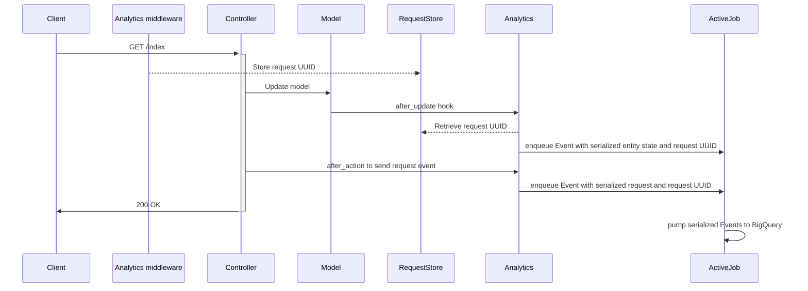

# DfE::Analytics

**👉 Send every web request and database update to BigQuery**

**✋ Skip or hide fields containing PII**

**✌️  Configure and forget**

## Introduction

This gem provides an _opinionated integration_ with Google Cloud Platform (GCP)
BigQuery.

Once it is set up, every web request and database update, as permitted by
configuration, will flow to BigQuery.

It also provides a Rake task for backfilling BigQuery with entities created
before you started sending events.

To set the gem up follow the steps in [Installation](#installation), below.

## See also

[dfe-analytics-dataform](https://github.com/DFE-Digital/dfe-analytics-dataform) provides a JavaScript package designed to generate SQL queries executed in [Dataform](https://dataform.co/) that transform data streamed into BigQuery by this gem into useful tables for quicker analysis and visualisation.

## Names and jargon

A Rails model is an analytics **entity**. All models are entities, but not all
entities are models — for example, an entity could be an association in a
many-to-many join table. **Entities** share their names with database tables.

A change to a entity (update, creation or deletion) is an analytics **event**.
When an entity changes we send the entire new state of the entity as part of
the event.

A web request is an analytics **event**.

You can also define custom **events**.

## Architecture



## Dependencies

A Rails app. Whilst it's possible to use DfE::Analytics without ActiveJob, ActiveJob
is recommended.

## Installation

Before you can send data to BigQuery with DfE::Analytics you'll need to setup
your Google Cloud project. See the [Google Cloud setup guide](docs/google_cloud_bigquery_setup.md)
for instructions on how to do that.

### 1. Add DfE::Analytics to your app

The `dfe-analytics` gem hasn't been published to Rubygems yet, so it needs to be
retrieved from GitHub. Check for the latest tagged version in GitHub and provide
that to the `tag` argument in your Gemfile. Dependabot will update this for you
when it finds a new tagged version.

```ruby
gem 'dfe-analytics', github: 'DFE-Digital/dfe-analytics', tag: 'v1.6.0'
```

then

```bash
bundle install
```

and

```bash
bundle exec rails generate dfe:analytics:install
```

This will create some configuration files, including `config/initializers/dfe_analytics.rb`.

While you’re setting things up, consider setting `config.async = false` and
`config.log_only = true` to take ActiveJob and BigQuery out of the loop.

### 2. BigQuery setup and configuration

Ensure project is set up as per the [Google Cloud setup guide](docs/google_cloud_bigquery_setup.md) above.

Set the following environment variables for your Rails app:

```
BIGQUERY_TABLE_NAME=events
BIGQUERY_PROJECT_ID=your-bigquery-project-name
BIGQUERY_DATASET=your-bigquery-dataset-name
```

If you're stuck with differently-named env vars, you can configure the names in
`dfe_analytics.rb`.

### 3. BigQuery authentication method

#### 3.1 Workload Identity Federation

We recommend using Workload identity federation as your authentication method, to avoid security risks associated with the use of long-lived plain text JSON API Keys.

Workload Identity Federation is detailed in the [Workload Identity Federation Setup](docs/google_cloud_bigquery_setup.md#workload-identity-federation-setup) guide.

To enable the workload identity federation authentication method, update the configuration option in `config/initializers/dfe_analytics.rb`:

```ruby
config.azure_federated_auth = true
```

#### 3.2 API Key

Some projects are still using JSON API Keys to authenticate with Google cloud. This method of authentication is still supported for legacy purposes.

To use API Keys, set the following configuration option in `config/initializers/dfe_analytics.rb`:

```ruby
config.azure_federated_auth = false
```

To create an API Key follow the steps below:

1. Access the service account in [IAM](https://console.cloud.google.com/iam-admin/serviceaccounts) you previously set up
2. Go to the keys tab, click on "Add key" > "Create new key"
3. Create a JSON private key. This file will be downloaded to your local system.

Once you have the key, set the following environment variables for your Rails
app.

```
BIGQUERY_API_JSON_KEY=<contents of the JSON, make sure to strip or escape newlines>
```

If you're stuck with differently-named env vars, you can configure the names in
`dfe_analytics.rb`.

### 4. Set up a queue

Unless you are using the `config.async = false` setting (not recommended for
production), events are sent to BigQuery via ActiveJob.

Events are generated on each web request and database insert/update/delete
query. Depending on the architecture of your application, many jobs
could be enqueued as users interact with your application.

Consider how this may impact the processing of the other jobs in your
application. We recommend setting a dedicated custom queue name in
`config/initializers/dfe_analytics.rb`:

```ruby
config.queue = :dfe_analytics
```

Please note that a custom queue will require the queue to be defined in your ActiveJob adapter configuration.

Also consider setting the priority of the jobs according to your chosen ActiveJob adapter's conventions. For Sidekiq, your `config/sidekiq.yml` file might look like this:

```yaml
---
:queues:
  - default
  - mailers
  - dfe_analytics
```

High-traffic applications may require a dedicated worker.

### 5. Send database events

The `dfe:analytics:install` generator will also initialize some empty config files:

| Filename                              | Purpose                                                                                                            |
|---------------------------------------|--------------------------------------------------------------------------------------------------------------------|
| `config/analytics.yml`                | List all fields we will send to BigQuery                                  |
| `config/analytics_hidden_pii.yml`     | List all fields we will send separately to BigQuery where they will be hidden. This should be a subset of fields in `analytics.yml`                                                                          |
| `config/analytics_blocklist.yml`      | Autogenerated file to list all fields we will NOT send to BigQuery, to support the `analytics:check` task                                                                                              |
| `config/analytics_custom_events.yml`  | Optional file including list of all custom event names                                                             |

**It is imperative that you perform a full check of the fields that are being sent, and exclude those containing personally-identifiable information (PII) in `config/analytics_hidden_pii.yml`, in order to comply with the requirements of the [Data Protection Act 2018](https://www.gov.uk/data-protection), unless an exemption has been obtained.**

When you first install the gem, none of your fields will be listed in `analytics.yml`, so no data will be sent to BigQuery. To get started, generate a blocklist using this command:

```bash
bundle exec rails dfe:analytics:regenerate_blocklist
```

Work through `analytics_blocklist.yml` to move entries into `analytics.yml` and
optionally also to `analytics_hidden_pii.yml`.

When you boot your app, DfE::Analytics will raise an error if there are
fields in your field configuration which are present in the database but
missing from the config, or present in the config but missing from the
database.

If for any reason you get stuck with an error that you can't resolve, you can
use the `SUPPRESS_DFE_ANALYTICS_INIT` env var to temporarily skip the startup
check.

```bash
SUPPRESS_DFE_ANALYTICS_INIT=true bundle exec rails c
```

Once `analytics.yml` and friends are populated, the associated models will be
automatically instrumented to send updates to BigQuery via ActiveRecord
callbacks.

### 6. Send web request events

#### Web requests

Including `DfE::Analytics::Requests` in your `ApplicationController` will cause
it and all inheriting controllers to send web request events to BigQuery. (This
is probably what you want).

```ruby
class ApplicationController < ActionController::Base
  include DfE::Analytics::Requests

  # This method MAY be present in your controller, returning
  # either nil or an object implementing an .id method.
  #
  # def current_user; end

  # This method MAY be present in your controller. If so, it should
  # return a string - return value will be attached to web_request events.
  #
  # def current_namespace; end
end
```

Web request events will try to add a `user_id` to the event data sent to
BigQuery. The `user_id` will only be populated if the controller defines a
`current_user` method whose return value responds to `.id`.

If a field other than `id` is required for the user identifier, then a custom
user identifier proc can be defined in `config/initializers/dfe_analytics.rb`:

```ruby
DfE::Analytics.config.user_identifier = proc { |user| user&.uid }
```

You can specify paths that should be excluded from logging using the skip_web_requests configuration option. This is useful for endpoints like health checks that are frequently hit and do not need to be logged.

```ruby
DfE::Analytics.configure do |config|
  # other configurations...

  # Specify paths to skip
  config.excluded_paths = ['/healthcheck', %r{^/admin}, %r{/api/v1/status}]
end
```

### 7. Import existing data

To load the current contents of your database into BigQuery, run

```bash
bundle exec rails dfe:analytics:import_all_entities
```

To reimport just one entity, run:

```bash
bundle exec rails dfe:analytics:import_entity[entity_name]
```

where `entity_name` is the name of the table you wish to import.

**IMPORTANT**: if you have a lot of records, this will enqueue a lot of jobs.
Consider not running an
import when there is a lot of traffic on your service.

An entity will only be loaded if it has a primary key. For some entities, such as join tables,
it might be necessary to add a primary key to the table and to update the relevant `analytics.yml`, prior to running the import.

## Custom events

If you wish to send custom analytics event, for example if you have data about emails sent, server-side validation errors, API query data, or data relating to searches performed, create a file `config/analytics_custom_events.yml` containing an array of your custom events types under a `shared` key like:

```yaml
shared:
  - some_custom_event
  - another_custom_event 
```

Then in the code create your custom event and attach all the information you want to pass:

```ruby
event = DfE::Analytics::Event.new
  .with_type(:some_custom_event)
  .with_user(current_user)
  .with_request_details(request)
  .with_namespace('some_namespace')
  .with_data(data: { some: 'custom details about event' })
```

If you need to include hidden PII, you can use the `hidden_data` key which will allow all fields listed to be sent separately to BigQuery where they will be hidden.

```ruby
event = DfE::Analytics::Event.new
  .with_type(:some_custom_event)
  .with_user(current_user)
  .with_request_details(request)
  .with_namespace('some_namespace')
  .with_data(
    data:
    {
      some: 'custom details about event'
    },
    hidden_data: {
      some_hidden: 'some data to be hidden',
      more_hidden: 'more data to be hidden,
    }
  )
```

**NOTE**:

Backwards compatability for the `with_data` method was added after v1.15.2 that allows the following call:

```ruby
  event
    .with_data(
       some: 'custom details about event'
    )
```

Backwards compatibility was missing in analytics versions v1.13.0 - v1.15.2 inclusive. This means that any custom events or other events using the `with_data` method for adding event data, sent from applications with analytics versions not backwards compatible, would have lost those events (unless event data is sent using the  `data` and/or `hidden_data` keys).

Once all the events have been constructed, simply send them to your analytics:

```ruby
DfE::Analytics::SendEvents.do([event, event2, event3])
```

### Entity Table Check Job

If you are using a background processing tool or scheduler (such as Sidekiq, Sidekiq-Cron, Resque, Delayed Job or other alternatives), you may want to configure the Entity Table Check Job. This job is designed to ensure the latest version of an entity table in BigQuery is in sync with the database. It is advisable to schedule this job to run on a nightly basis for consistent data verification.

To enable the Entity Table Check Job, update the configuration option in `config/initializers/dfe_analytics.rb`:

```ruby
config.entity_table_checks_enabled = true
```

Once enabled, you will need to configure the job according to the syntax and settings of your chosen background processor or scheduler. Below is an example using Sidekiq-Cron, but similar settings apply for other systems like Resque-Scheduler or Delayed Job's recurring jobs:

```
send_entity_table_checks_to_bigquery:
  cron: "30 0 * * *"  # Every day at 00:30.
  class: "DfE::Analytics::EntityTableCheckJob"
  queue: dfe_analytics
```

## Testing

### Testing modes

The gem comes with a testing mode which prevents real analytics from being recorded when running tests.

```ruby
require 'dfe/analytics/testing'

DfE::Analytics::Testing.fake!

DfE::Analytics::Testing.webmock!
```

- `fake!` is the default mode, and this stubs the BigQuery client meaning no requests are made
- `webmock!` makes the library act as normal, allowing you to write tests against mocked requests

### RSpec matcher

The Gem also comes with an RSpec matcher that can be used to ensure that an integration exists in controllers and models. The RSpec matcher file needs to be required into specs, and provides two different styles of matcher to use:

```ruby
require 'dfe/analytics/rspec/matchers'

# have_sent_analytics_event_types take a block and expects event types to be sent
# when that block is called
it "sends a DFE Analytics web request event" do
  expect do
    get '/api/test'
  end.to have_sent_analytics_event_types(:web_request)
end

# have_been_enqueued_as_analytics_events expects that as part of the spec, event types 
# have been sent
it "sends DFE Analytics request and entity events" do
  perform_user_sign
  expect(:web_request, :update_entity).to have_been_enqueued_as_analytics_events
end

```

See the list of existing event types below for what kinds of event types can be used with the above matchers.

## Existing DfE Analytics event types

The different types of events that DfE Analytics send are:

- `web_request` - sent after a controller action is performed using controller callbacks
- `create_entity` - sent after an object is created using model callbacks
- `update_entity` - sent after an object is updated using model callbacks
- `delete_entity` - sent after an object is deleted using model callbacks
- `import_entity` - sent for each object imported using the DfE Analytics import rake tasks

## Event debugging

If you wish to log events for debug purposes, create a file `config/analytics_event_debug.yml` containing an array of your event filters  under a `shared` key like:

```yaml
shared:
  event_filters:
    -
      event_type: (create|update|delete)_entity
      entity_table_name: course_options
      data:
        key: id
        value: 12345
    -
      event_type: import_entity
      entity_table_name: courses
```

Event filters allow targeted event logging for diagnostic and debug purposes. The logging level is `info`.

When defining event filters, note the following:
- All values are converted to regular expressions for matching
- Any filter fields can be defined as long as the field exists in the target event
- A filter must be a hash and nested fields are allowed
- If a corresponding hash field in the target event is not found, then the remaining value in the target is converted into a string and compared with the value from the filter. The remaining nested fields in the filter are then ignored. This may result in a wider match than expected. Please see section on matching for non hash fields below
- If there are multiple filters then at least one must match the event
- All filter fields must match the event fields for a filter to match

In the above example, all create, delete or update entity events to the `course_options` table and `id` matching value `1234` will be logged, or any import entity events to the `courses` table will also be logged.

**IMPORTANT**:

Please ensure you are not logging sensitive data to debug. Your project should define blocklist and pii (personally identifiable information) fields, so these should prevent any sensitive data appearing in the events.

Logging to debug should only be used for diagnosis/investigation purposes. Once diagnosis/investigation is complete, the logging to debug should be removed.

### Matching on non-hash fields

This is best demonstrated by example.

Given the above event filters and the following target event:

``` Ruby
  {
    'entity_table_name' => 'course_options',
    'event_type' => 'update_entity',
    'data' => [
      { 'key' => 'id', 'value' => ['12345'] },
      { 'key' => 'course_id', 'value' => ['42'] }
    ]
  }
```

Then on matching, there is a one to one correspondence on the `entity_table_name` and `event_type` fields, so these match OK. However, in the target event `data` field there is no hash value, so the `key` field with value of `id` is compared with the whole of the target `data` field converted to a string, and the `value` field with value of `12345` would also be compared with the whole of the target `data` field.

So the comparisons in Ruby would be:

``` Ruby
  /id/ =~ "[{ 'key' => 'id', 'value' => ['12345'] }, { 'key' => 'course_id', 'value' => ['42'] }]"
  /12345/ =~ "[{ 'key' => 'id', 'value' => ['12345'] }, { 'key' => 'course_id', 'value' => ['42'] }]"
```

The fields do match successfully, but note the the first comparison matches `id` on `id` and `course_id` so the match would be wider than expected in some instances.

## Page Caching

This section is applicable if your app uses standard Rails rack middleware page
caching. For other forms of page caching please read the IMPORTANT note below.
If your App does not cache any pages, you can skip this section.

Any page visit in the app will result in a web request event being sent to BigQuery. The event is automatically sent by a Controller after action callback included along with `DfE::Analytics::Requests`. However, cached pages that are served from rack middleware return early and therefore do not execute any actions in the controller. This means that any cached page visits handled by rack middleware do NOT result in a web request event being sent to BigQuery.

To overcome this issue the gem allows the sending of web request events from rack middleware, before the cached page is served.

If a page is cached by rack middleware and served by `ActionDispatch::Static`, then a custom `rack_page_cached` proc must be defined in `config/initializers/dfe_analytics.rb`, that returns a boolean indicating whether the page is cached by rack.

For example, if a projects uses standard rails page caching, then a custom `rack_page_cached` proc  can be defined in `config/initializers/dfe_analytics.rb` as follows:


```ruby
DfE::Analytics.config.rack_page_cached = proc do |rack_env|
   Rails.application.config.action_controller.perform_caching &&
     ActionDispatch::FileHandler.new(Rails.root.join("public/cached_pages").to_s).attempt(rack_env).present?
end
```

**IMPORTANT**

`rack_page_cached` must only return `true` if a specific request for a page is in the cache and the cached page is served by `ActionDispatch::Static` rack middleware. Otherwise web request events might be sent twice, resulting in inaccurate information in BigQuery. Please note that the cached page must be served by `ActionDispatch::Static`, otherwise the proc will fail to run.

Please note that page caching is project specific and each project must carefully consider how pages are cached and whether web request events are sent. If page caching on your project results in web request events not being sent, and the above does not resolve the issue, then please get in touch with the data insights team though slack.


## Contributing

1. Make a copy of this repository
2. Install dependencies: `bundle install`
3. Create dummy app db: `( cd spec/dummy ; bundle exec rake db:setup )`
4. Run the tests: `bundle exec rspec`
5. Run rubocop: `bundle exec rubocop`

## Releasing

1. Merge all changes to be included in the release into the main branch and run a `git pull` on your local main branch
2. Checkout a release branch: `git checkout -b v${NEW_VERSION}-release`, e.g. `git checkout -b v1.3.0-release`
3. Whilst on the release branch, bump the version and generate the CHANGELOG.md. `rake prepare_release[minor]`
> **NB**: Any updated dependencies will reflect in the `Gemfile.lock`. This only affects the local dev env, and only require that specs pass
>   It could be nice to have tests to prove that connectivity to GCP still works after an update, but we aren't setup for that yet
4. Verify committed `CHANGELOG.md` changes and alter if necessary: `git show`
5. Push the branch: `git push origin v${NEW_VERSION}-release`, e.g. `git push origin v1.3.0-release`
6. Raise a version release PR on GitHub with the label `version-release`, and wait for approval
7. Merge the version release PR into main
8. Tag the release by running `git tag v${NEW_VERSION}` followed by `git push --tags origin`

IMPORTANT:  Pushing the tags will immediately make the release available even on a unmerged branch. Therefore, push the tags to Github only when the PR is approved and immediately prior to merging the PR.

## License

The gem is available as open source under the terms of the [MIT License](https://opensource.org/licenses/MIT).
