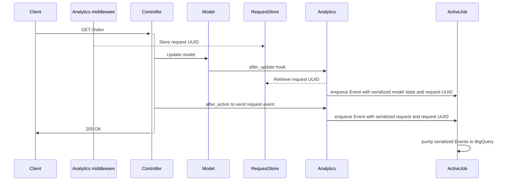

# DfE::Analytics

**👉 Send every web request and model update to BigQuery**

**✋ Skip or anonymise fields containing PII**

**✌️  Configure and forget**

## Overview

This gem provides an _opinionated integration_ with Google BigQuery.

Once it is set up, every web request and database update (as permitted by
configuration) will flow to BigQuery.

It also provides a Rake task for backfilling BigQuery with models created
before you started sending events (see **Importing existing data** below), and
one for keeping your field configuration up to date.

To set the gem up follow the steps in "Configuration", below.

## Names and jargon

A Rails model is an analytics **Entity**.

A change to a model (including creation and deletion) is an analytics
**Event**. When a model changes we send the entire new state of the model as
part of the event.

A web request is also an analytics **Event**.

## Architecture



## Dependencies

A Rails app with `ActiveJob` configured.

## Installation

```ruby
gem 'dfe-analytics'
```

then

```bash
bundle install
```

## Configuration

### 1. Configure BigQuery connection, feature flags etc

```bash
bundle exec rails generate dfe:analytics:install
```

and follow comments in `config/initializers/dfe_analytics.rb`.

The `dfe:analytics:install` generator will also initialize some empty config files:

| Filename | Purpose |
|----------|---------|
| `config/analytics.yml` | List all fields we will send to BigQuery |
| `config/analytics_pii.yml` | List all fields we will obfuscate before sending to BigQuery. This should be a subset of fields in `analytics.yml` |
| `config/analytics_blocklist.yml` | Autogenerated file to list all fields we will NOT send to BigQuery, to support the `analytics:check` task |

### 2. Check your fields

A good place to start is to run

```bash
bundle exec rails dfe:analytics:regenerate_blocklist
```

to populate `analytics_blocklist.yml`. Work through this file to move entries
into `analytics.yml` and optionally also to `analytics_pii.yml`.

Finally, run

```bash
bundle exec rails dfe:analytics:check
```

This will let you know whether there are any fields in your field configuration
which are present in the model but missing from the config, or present in the
config but missing from the model.

**It's recommended to run this task regularly - at least as often as you run
database migrations. Consider enhancing db:migrate to run it automatically.**

### 3. Enable callbacks

Mix in the following modules. It's recommended to include them at the
highest possible level in the inheritance hierarchy of your controllers and
models so that they are effective everywhere. A standard Rails application will
have all controllers inheriting from `ApplicationController` and all models
inheriting from `ApplicationRecord`, so these should be a good place to start.

#### Controllers

```ruby
class ApplicationController < ActionController::Base
  include DfE::Analytics::Requests

  # This method MUST be present in your controller and should return
  # either nil or an object implementing an .id method.
  #
  # def current_user; end

  # This method MAY be present in your controller. If so, it should
  # return a string - return value will be attached to web_request events.
  #
  # def current_namespace; end
end
```

##### Models

```ruby
class ApplicationRecord < ActiveRecord::Base
  include DfE::Analytics::Entities
end
```

If everything has worked, you should see jobs flowing into your queues on each
web request and model update. While you’re setting things up consider setting
the config options `async: false` and `log_only: true` to take ActiveJob and
BigQuery (respectively) out of the loop.

### 4. Adding specs

The `dfe-analytics` gem comes with an RSpec matcher that can be used to ensure
that an integration exists in controllers and models. The RSpec matcher file
needs to be required into specs, and provides two different styles of matchers
to use:

``` ruby
require 'dfe/analytics/rspec/matchers'

# have_sent_analytics_event_types take a block and expects event types to be sent
# when that block is called
it "sends a DFE Analytics web request event" do
  expect do
    get '/api/test'
  end.to have_sent_analytics_event_types(:web_request)
end

# have_been_enqueued_as_analytics_events expects that as part of the spec, event types 
# have been sent
it "sends DFE Analytics request and entity events" do
  perform_user_sign
  expect(:web_request, :update_entity).to have_been_enqueued_as_analytics_events
end

```

See the list of existing event types below for what kinds of event types can be used with the above matchers. 

## Existing DfE Analytics event types

The different types of events that DfE Analytics send are:

- `web_request` - sent after a controller action is performed using controller callbacks
- `create_entity` - sent after an object is created using model callbacks 
- `update_entity` - sent after an object is updated using model callbacks
- `delete_entity` - sent after an object is deleted using model callbacks
- `import_entity` - sent for each object imported using the DfE Analytics import rake tasks

## Importing existing data

Run

```bash
bundle exec rails dfe:analytics:import_all_entities
```

To reimport just one model, run:

```bash
bundle exec rails dfe:analytics:import_entity[ModelName]
```

## Contributing

1. Make a copy of this repository
2. Install dependencies: `bundle install`
3. Create dummy app db: `( cd spec/dummy ; bundle exec rake db:setup )`
4. Run the tests: `bundle exec rspec`
5. Run rubocop: `bundle exec rubocop`

## Releasing

Dependencies:

- [github_changelog_generator](https://github.com/github-changelog-generator/Github-Changelog-Generator)
- [gem_release](https://github.com/svenfuchs/gem-release) (or DIY)

1. Raise a PR bumping the version and get it merged
1. On `main`, tag the current version using `gem tag`. Tags should be in the form `vX.X.X`
1. Push the tag: `git push origin <tag name>` (or use `gem tag -p` and skip this step)
1. Generate a changelog: `github_changelog_generator -u DFE-Digital -p dfe-analytics` and PR that.

## License

The gem is available as open source under the terms of the [MIT License](https://opensource.org/licenses/MIT).
