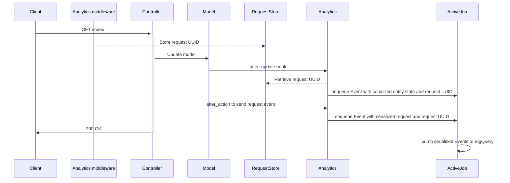

# DfE::Analytics

**👉 Send every web request and database update to BigQuery**

**✋ Skip or anonymise fields containing PII**

**✌️  Configure and forget**

## Overview

This gem provides an _opinionated integration_ with Google BigQuery.

Once it is set up, every web request and database update (as permitted by
configuration) will flow to BigQuery.

It also provides a Rake task for backfilling BigQuery with entities created
before you started sending events (see **Importing existing data** below), and
another for keeping your field configuration up to date.

To set the gem up follow the steps in "Configuration", below.

## See also

[dfe-analytics-dataform](https://github.com/DFE-Digital/dfe-analytics-dataform) provides a JavaScript package designed to generate SQL queries executed in [Dataform](https://dataform.co/) that transform data streamed into BigQuery by this gem into useful tables for quicker analysis and visualisation.

## Names and jargon

A Rails model is an analytics **Entity**. All models are entities, but not all
entities are models — for example, an entity could be an association in a
many-to-many join table.

A change to a entity (update, creation or deletion) is an analytics **Event**.
When an entity changes we send the entire new state of the entity as part of
the event.

A web request is also an analytics **Event**.

## Architecture



## Dependencies

A Rails app with `ActiveJob` configured.

## Installation

```ruby
gem 'dfe-analytics'
```

then

```bash
bundle install
```

## Configuration


### 1. Get a BigQuery project setup and add initial owners

Ask in Slack on the `#twd_data_insights` channel for someone to help you
procure a BigQuery instance in the `digital.education.gov.uk` Google Cloud
Organisation.

Ask - or ask your Delivery Manager to ask - for your `@digital.education.gov.uk` Google account to be setup as an owner
via the IAM and Admin settings. Add other team members as necessary.

#### Set up billing

You also need to set up your BigQuery instance with paid billing. This is
because `dfe-analytics` uses streaming, and streaming isn't allowed in the free
tier:

```
accessDenied: Access Denied: BigQuery BigQuery: Streaming insert is not allowed
in the free tier
```

### 2. Create a dataset and table

You should create separate datasets for each environment (dev, qa, preprod, prod etc.).

1. Open your project's BigQuery instance
2. Go to the Analysis -> SQL Workspace section
3. Tap on the 3 dots next to the project name, "Create data set"
4. Name it something like `APPLICATIONNAME_events_ENVIRONMENT`, such as `applyforqts_events_production`, and set the location to `europe-west2 (London)`
5. Select your new dataset
6. Open a new query execution tab.
7. Edit [create-events-table.sql](https://github.com/DFE-Digital/dfe-analytics/create-events-table.sql) to add your table name, and run it in the query execution tab in BigQuery to create a blank events table for dfe-analytics to stream data into.

### 4. Create custom roles

1. Go to IAM and Admin settings > Roles
1. Click on "+ Create role"
1. Create the 3 roles outlined below

#### Analyst

| Field             | Value                                              |
| ----------------- | -------------------------------------------------- |
| Title             | **BigQuery Analyst Custom**                        |
| Description       | Assigned to accounts used by analysts and SQL developers. |
| ID                | `bigquery_analyst_custom`                          |
| Role launch stage | General Availability                               |
| + Add permissions | See below                                          |

<details>
<summary>Permissions for bigquery_analyst_custom</summary>
<pre>
bigquery.datasets.get
bigquery.datasets.getIamPolicy
bigquery.datasets.updateTag
bigquery.jobs.create
bigquery.jobs.get
bigquery.jobs.list
bigquery.jobs.listAll
bigquery.models.export
bigquery.models.getData
bigquery.models.getMetadata
bigquery.models.list
bigquery.routines.get
bigquery.routines.list
bigquery.savedqueries.create
bigquery.savedqueries.delete
bigquery.savedqueries.get
bigquery.savedqueries.list
bigquery.savedqueries.update
bigquery.tables.createSnapshot
bigquery.tables.export
bigquery.tables.get
bigquery.tables.getData
bigquery.tables.getIamPolicy
bigquery.tables.list
bigquery.tables.restoreSnapshot
resourcemanager.projects.get
</pre>
</details>

#### Developer

| Field             | Value                                    |
| ----------------- | ---------------------------------------- |
| Title             | **BigQuery Developer Custom**            |
| Description       | Assigned to accounts used by developers. |
| ID                | `bigquery_developer_custom`              |
| Role launch stage | General Availability                     |
| + Add permissions | See below                                |

<details>
<summary>Permissions for bigquery_developer_custom</summary>
<pre>
bigquery.connections.create
bigquery.connections.delete
bigquery.connections.get
bigquery.connections.getIamPolicy
bigquery.connections.list
bigquery.connections.update
bigquery.connections.updateTag
bigquery.connections.use
bigquery.datasets.create
bigquery.datasets.delete
bigquery.datasets.get
bigquery.datasets.getIamPolicy
bigquery.datasets.update
bigquery.datasets.updateTag
bigquery.jobs.create
bigquery.jobs.delete
bigquery.jobs.get
bigquery.jobs.list
bigquery.jobs.listAll
bigquery.jobs.update
bigquery.models.create
bigquery.models.delete
bigquery.models.export
bigquery.models.getData
bigquery.models.getMetadata
bigquery.models.list
bigquery.models.updateData
bigquery.models.updateMetadata
bigquery.models.updateTag
bigquery.routines.create
bigquery.routines.delete
bigquery.routines.get
bigquery.routines.list
bigquery.routines.update
bigquery.routines.updateTag
bigquery.savedqueries.create
bigquery.savedqueries.delete
bigquery.savedqueries.get
bigquery.savedqueries.list
bigquery.savedqueries.update
bigquery.tables.create
bigquery.tables.createSnapshot
bigquery.tables.delete
bigquery.tables.deleteSnapshot
bigquery.tables.export
bigquery.tables.get
bigquery.tables.getData
bigquery.tables.getIamPolicy
bigquery.tables.list
bigquery.tables.restoreSnapshot
bigquery.tables.setCategory
bigquery.tables.update
bigquery.tables.updateData
bigquery.tables.updateTag
resourcemanager.projects.get
</pre>
</details>

#### Appender

| Field             | Value                                                      |
| ----------------- | ---------------------------------------------------------- |
| Title             | **BigQuery Appender Custom**                               |
| Description       | Assigned to accounts used by appenders (apps and scripts). |
| ID                | `bigquery_appender_custom`                                 |
| Role launch stage | General Availability                                       |
| + Add permissions | See below                                                  |

<details>
<summary>Permissions for bigquery_appender_custom</summary>
<pre>
bigquery.datasets.get
bigquery.tables.get
bigquery.tables.updateData
</pre>
</details>

### 5. Create an appender service account

1. Go to [IAM and Admin settings > Create service account](https://console.cloud.google.com/projectselector/iam-admin/serviceaccounts/create?supportedpurview=project)
1. Name it like "Appender NAME_OF_SERVICE ENVIRONMENT" e.g. "Appender ApplyForQTS Production"
1. Add a description, like "Used when developing locally."
1. Grant the service account access to the project, use the "BigQuery Appender Custom" role you set up earlier

### 6. Get an API JSON key :key:

1. Access the service account you previously set up
1. Go to the keys tab, click on "Add key > Create new key"
1. Create a JSON private key

The full contents of this JSON file is your `BIGQUERY_API_JSON_KEY`.

### 7. Set up environment variables

Putting the previous things together, to finish setting up `dfe-analytics`, you
need these environment variables:

```
BIGQUERY_TABLE_NAME=events
BIGQUERY_PROJECT_ID=your-bigquery-project-name
BIGQUERY_DATASET=your-bigquery-dataset-name
BIGQUERY_API_JSON_KEY=<contents of the JSON, make sure to strip or escape newlines>
```

### 8. Configure BigQuery connection, feature flags etc

```bash
bundle exec rails generate dfe:analytics:install
```

and follow comments in `config/initializers/dfe_analytics.rb`.

The `dfe:analytics:install` generator will also initialize some empty config files:

| Filename | Purpose |
|----------|---------|
| `config/analytics.yml` | List all fields we will send to BigQuery |
| `config/analytics_pii.yml` | List all fields we will obfuscate before sending to BigQuery. This should be a subset of fields in `analytics.yml` |
| `config/analytics_blocklist.yml` | Autogenerated file to list all fields we will NOT send to BigQuery, to support the `analytics:check` task |

### 9. Check your fields

A good place to start is to run

```bash
bundle exec rails dfe:analytics:regenerate_blocklist
```

to populate `analytics_blocklist.yml`. Work through this file to move entries
into `analytics.yml` and optionally also to `analytics_pii.yml`.

Finally, run

```bash
bundle exec rails dfe:analytics:check
```

This will let you know whether there are any fields in your field configuration
which are present in the database but missing from the config, or present in the
config but missing from the database.

**It's recommended to run this task regularly - at least as often as you run
database migrations. Consider enhancing db:migrate to run it automatically.**

### 10. Enable callbacks

Mix in the following modules. It's recommended to include them at the
highest possible level in the inheritance hierarchy of your controllers and
models so that they are effective everywhere. A standard Rails application will
have all controllers inheriting from `ApplicationController` and all models
inheriting from `ApplicationRecord`, so these should be a good place to start.

#### Controllers

```ruby
class ApplicationController < ActionController::Base
  include DfE::Analytics::Requests

  # This method MAY be present in your controller, returning
  # either nil or an object implementing an .id method.
  #
  # def current_user; end

  # This method MAY be present in your controller. If so, it should
  # return a string - return value will be attached to web_request events.
  #
  # def current_namespace; end
end
```

##### Models

All models in your app will automatically send callbacks if their tables are
listed in `analytics.yml`. This is a change from versions < v1.4 where it was
necessary to manually mix in `DfE::Analytics::Entities`. This did not support
sending events on `has_and_belongs_to_many` tables.

While you’re setting things up consider setting the config options `async:
false` and `log_only: true` to take ActiveJob and BigQuery (respectively) out
of the loop.

### Adding specs

#### Testing modes

The `dfe-analytics` Gem comes with a testing mode which prevents real analytics from being recorded when running tests.

```ruby
require 'dfe/analytics/testing'

DfE::Analytics::Testing.fake!

DfE::Analytics::Testing.webmock!
```

- `fake!` is the default mode, and this effectively stubs the BigQuery client meaning no requests are made.
- `webmock!` makes the library act as normal, allowing you to write tests against mocked requests.

#### Matchers

The Gem also comes with an RSpec matcher that can be used to ensure that an integration exists in controllers and models. The RSpec matcher file needs to be required into specs, and provides two different styles of matchers to use:

```ruby
require 'dfe/analytics/rspec/matchers'

# have_sent_analytics_event_types take a block and expects event types to be sent
# when that block is called
it "sends a DFE Analytics web request event" do
  expect do
    get '/api/test'
  end.to have_sent_analytics_event_types(:web_request)
end

# have_been_enqueued_as_analytics_events expects that as part of the spec, event types 
# have been sent
it "sends DFE Analytics request and entity events" do
  perform_user_sign
  expect(:web_request, :update_entity).to have_been_enqueued_as_analytics_events
end

```

See the list of existing event types below for what kinds of event types can be used with the above matchers.

## Existing DfE Analytics event types

The different types of events that DfE Analytics send are:

- `web_request` - sent after a controller action is performed using controller callbacks
- `create_entity` - sent after an object is created using model callbacks 
- `update_entity` - sent after an object is updated using model callbacks
- `delete_entity` - sent after an object is deleted using model callbacks
- `import_entity` - sent for each object imported using the DfE Analytics import rake tasks

## Importing existing data

Run

```bash
bundle exec rails dfe:analytics:import_all_entities
```

To reimport just one entity, run:

```bash
bundle exec rails dfe:analytics:import_entity[entity_name]
```

## Contributing

1. Make a copy of this repository
2. Install dependencies: `bundle install`
3. Create dummy app db: `( cd spec/dummy ; bundle exec rake db:setup )`
4. Run the tests: `bundle exec rspec`
5. Run rubocop: `bundle exec rubocop`

## Releasing

1. Checkout a release branch: `git checkout -b v${NEW_VERSION}-release`, e.g. `git checkout -b v1.3.0-release`
2. Bump the version and generate the CHANGELOG.md. This will commit and tag changes: `rake prepare_release[minor]`
> **NB**: Any updated dependencies will reflect in the `Gemfile.lock`. This only affects the local dev env, and only require that specs pass.
> 	It could be nice to have tests to prove that connectivity to GCP still works after an update, but we aren't setup for that yet.
3. (Optional) Verify committed `CHANGELOG.md` changes and alter if necessary: `git show`
4. Push the branch: `git push origin v${NEW_VERSION}-release`, e.g. `git push origin v1.3.0-release`
5. Push the tags: `git push --tags`
6. Cut a PR on GitHub and merge once approved. 

## License

The gem is available as open source under the terms of the [MIT License](https://opensource.org/licenses/MIT).
