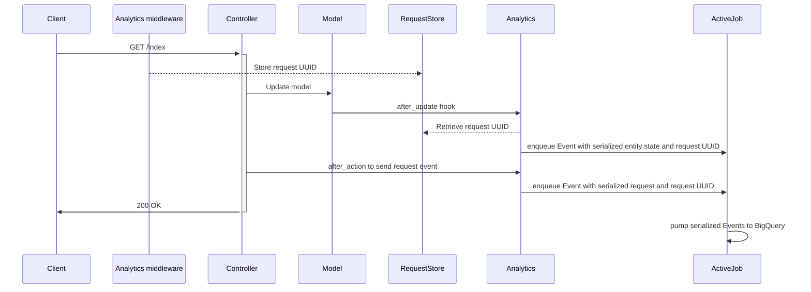

# DfE::Analytics

**👉 Send every web request and database update to BigQuery**

**✋ Skip or anonymise fields containing PII**

**✌️  Configure and forget**

## Overview

This gem provides an _opinionated integration_ with Google Cloud Platform (GCP)
BigQuery.

Once it is set up, every web request and database update (as permitted by
configuration) will flow to BigQuery.

It also provides a Rake task for backfilling BigQuery with entities created
before you started sending events (see **Importing existing data** below), and
another for keeping your field configuration up to date.

To set the gem up follow the steps in "Configuration", below.

## See also

[dfe-analytics-dataform](https://github.com/DFE-Digital/dfe-analytics-dataform) provides a JavaScript package designed to generate SQL queries executed in [Dataform](https://dataform.co/) that transform data streamed into BigQuery by this gem into useful tables for quicker analysis and visualisation.

## Names and jargon

A Rails model is an analytics **Entity**. All models are entities, but not all
entities are models — for example, an entity could be an association in a
many-to-many join table.

A change to a entity (update, creation or deletion) is an analytics **Event**.
When an entity changes we send the entire new state of the entity as part of
the event.

A web request is also an analytics **Event**.

## Architecture



## Dependencies

A Rails app with `ActiveJob` configured.

## Installation

Before you can send data to BigQuery with `dfe-analytics` you'll need to setup
your Google Cloud project. See the [setup Google Cloud setup guide](docs/google_cloud_bigquery_setup.md)
for instructions on how to do that.

### 1. Add the dfe-analytics to your app

The `dfe-analytics` gem hasn't been published to Rubygems yet, so it needs to be
retrieved from GitHub. Check for the latest tagged version in GitHub and provide
that to the `tag` argument in your Gemfile. Dependabot will update this for you
when it finds a new tagged version.

```ruby
gem 'dfe-analytics', github: 'DFE-Digital/dfe-analytics', tag: 'v1.6.0'
```

then

```bash
bundle install
```

### 2. Get an API JSON key :key:

Depending on how your app environments are setup, we recommend you use the
service account created for the `development` environment on your localhost to
test integration with BigQuery. This requires that your project is setup in
Google Cloud as per the instructions above.

1. Access the `development` service account you previously set up
1. Go to the keys tab, click on "Add key" > "Create new key"
1. Create a JSON private key. This file will be downloaded to your local system.

The full contents of this JSON file is your `BIGQUERY_API_JSON_KEY`.

Use these steps to download a key to use in your deployed environment's secrets,

### 3. Set up environment variables

Putting the previous things together, to finish setting up `dfe-analytics`, you
need these environment variables:

```
BIGQUERY_TABLE_NAME=events
BIGQUERY_PROJECT_ID=your-bigquery-project-name
BIGQUERY_DATASET=your-bigquery-dataset-name
BIGQUERY_API_JSON_KEY=<contents of the JSON, make sure to strip or escape newlines>
```

### 4. Configure BigQuery connection, feature flags etc

```bash
bundle exec rails generate dfe:analytics:install
```

and follow comments in `config/initializers/dfe_analytics.rb`.

The `dfe:analytics:install` generator will also initialize some empty config files:

| Filename                              | Purpose                                                                                                            |
|---------------------------------------|--------------------------------------------------------------------------------------------------------------------|
| `config/analytics.yml`                | List all fields we will send to BigQuery                                                                           |
| `config/analytics_pii.yml`            | List all fields we will obfuscate before sending to BigQuery. This should be a subset of fields in `analytics.yml` |
| `config/analytics_blocklist.yml`      | Autogenerated file to list all fields we will NOT send to BigQuery, to support the `analytics:check` task          |
| `config/analytics_custom_events.yml`  | Optional file including list of all custom event names

**It is imperative that you perform a full check of those fields are being sent, and exclude those containing personally-identifiable information (PII) in `config/analytics_pii.yml`, in order to comply with the requirements of the [Data Protection Act 2018](https://www.gov.uk/data-protection), unless an exemption has been obtained.**

### 5. Check your fields

A good place to start is to run

```bash
bundle exec rails dfe:analytics:regenerate_blocklist
```

to populate `analytics_blocklist.yml`. Work through this file to move entries
into `analytics.yml` and optionally also to `analytics_pii.yml`.

Finally, run

```bash
bundle exec rails dfe:analytics:check
```

This will let you know whether there are any fields in your field configuration
which are present in the database but missing from the config, or present in the
config but missing from the database.

**It's recommended to run this task regularly - at least as often as you run
database migrations. Consider enhancing db:migrate to run it automatically.**

### 6. Enable callbacks

Mix in the following modules. It's recommended to include them at the
highest possible level in the inheritance hierarchy of your controllers and
models so that they are effective everywhere. A standard Rails application will
have all controllers inheriting from `ApplicationController` and all models
inheriting from `ApplicationRecord`, so these should be a good place to start.

### 7. Configure queues

Events are sent to BigQuery by your application's queueing backed via its ActiveJob adapter.

Events are generated on each web request and database insert/update/delete query. Depending on the architecture of your application, potentially many jobs could be enqueued as users interact with your application.

Consider how this may impact the processing of the other jobs in your application. Set a dedicated custom queue name rather than `:default` in `config/initializers/dfe_analytics.rb`:

```ruby
DfE::Analytics.config.queue = :dfe_analytics
```

Please note that a custom queue will require the queue to be defined in your ActiveJob adapter configuration.

Also consider setting the priority of the jobs according to your chosen ActiveJob adapter's conventions.

### 8. Custom events

If you wish to send custom analytics event, create a file `config/analytics_custom_events.yml` containing an array of your custom events types under a `shared` key like:

```yaml
shared:
  - some_custom_event
  - another_custom_event 
```

Then in the code create your custom event and attach all the information you want to pass:

```ruby
event = DfE::Analytics::Event.new
  .with_type(:some_custom_event)
  .with_user(current_user)
  .with_request_details(request)
  .with_namespace('some_namespace')
  .with_data(some: 'custom details about event')
```

Once all the events have been constructed, simply send them to your analytics:

```ruby
DfE::Analytics::SendEvents.do([event, event2, event3])
```

#### Controllers

```ruby
class ApplicationController < ActionController::Base
  include DfE::Analytics::Requests

  # This method MAY be present in your controller, returning
  # either nil or an object implementing an .id method.
  #
  # def current_user; end

  # This method MAY be present in your controller. If so, it should
  # return a string - return value will be attached to web_request events.
  #
  # def current_namespace; end
end
```

##### Models

All models in your app will automatically send callbacks if their tables are
listed in `analytics.yml`. This is a change from versions < v1.4 where it was
necessary to manually mix in `DfE::Analytics::Entities`. This did not support
sending events on `has_and_belongs_to_many` tables.

While you’re setting things up consider setting the config options `async:
false` and `log_only: true` to take ActiveJob and BigQuery (respectively) out
of the loop.

### 9. Web request event user identifier

#### User identifier

All web request events will add a `user_id` to the event data sent to BigQuery. The `user_id` will only be populated if the controller defines a `current_user` method and it responds to `id`, otherwise the `user_id` will be `nil`.

#### Custom User Identifier

If a field other than `id` is required for the user identifier, then a custom user identifier proc can be defined in `config/initializers/dfe_analytics.rb`:

```ruby
DfE::Analytics.config.user_identifier = proc { |user| user&.id }
```

#### User ID anonymisation

The `user_id` in the web request event will not be anonymised by default. This can be changed by updating the configuration option in `config/initializers/dfe_analytics.rb`:

```ruby
DfE::Analytics.config.anonymise_web_request_user_id = false
```

Anonymisation of `user_id` would be required if the source field in the schema is in `analytics_pii.yml` so that analysts can join the IDs together. If the `user_id` is not in `analytics_pii.yml` but is in `analytics.yml` then `user_id` anonymisation would *not* be required so that the IDs could still be joined together.

### Adding specs

#### Testing modes

The `dfe-analytics` Gem comes with a testing mode which prevents real analytics from being recorded when running tests.

```ruby
require 'dfe/analytics/testing'

DfE::Analytics::Testing.fake!

DfE::Analytics::Testing.webmock!
```

- `fake!` is the default mode, and this effectively stubs the BigQuery client meaning no requests are made.
- `webmock!` makes the library act as normal, allowing you to write tests against mocked requests.

#### Matchers

The Gem also comes with an RSpec matcher that can be used to ensure that an integration exists in controllers and models. The RSpec matcher file needs to be required into specs, and provides two different styles of matchers to use:

```ruby
require 'dfe/analytics/rspec/matchers'

# have_sent_analytics_event_types take a block and expects event types to be sent
# when that block is called
it "sends a DFE Analytics web request event" do
  expect do
    get '/api/test'
  end.to have_sent_analytics_event_types(:web_request)
end

# have_been_enqueued_as_analytics_events expects that as part of the spec, event types 
# have been sent
it "sends DFE Analytics request and entity events" do
  perform_user_sign
  expect(:web_request, :update_entity).to have_been_enqueued_as_analytics_events
end

```

See the list of existing event types below for what kinds of event types can be used with the above matchers.

## Existing DfE Analytics event types

The different types of events that DfE Analytics send are:

- `web_request` - sent after a controller action is performed using controller callbacks
- `create_entity` - sent after an object is created using model callbacks 
- `update_entity` - sent after an object is updated using model callbacks
- `delete_entity` - sent after an object is deleted using model callbacks
- `import_entity` - sent for each object imported using the DfE Analytics import rake tasks

## Importing existing data

Run

```bash
bundle exec rails dfe:analytics:import_all_entities
```

To reimport just one entity, run:

```bash
bundle exec rails dfe:analytics:import_entity[entity_name]
```

**IMPORTANT**:

Do not run an import when there is a lot of traffic on the website. Consider running the import out of hours or when the traffic is minimal.

## Event debugging

If you wish to log events for debug purposes, create a file `config/analytics_event_debug.yml` containing an array of your event filters  under a `shared` key like:

```yaml
shared:
  event_filters:
    -
      event_type: (create|update|delete)_entity
      entity_table_name: course_options
      data:
        key: id
        value: 12345
    -
      event_type: import_entity
      entity_table_name: courses
```

Event filters allow targeted event logging for diagnostic and debug purposes. The logging level is `info`.

When defining event filters, note the following:
- All values are converted to regular expressions for matching
- Any filter fields can be defined as long as the field exists in the target event
- A filter must be a hash and nested fields are allowed
- If a corresponding hash field in the target event is not found, then the remaining value in the target is converted into a string and compared with the value from the filter. The remaining nested fields in the filter are then ignored. This may result in a wider match than expected. Please see section on matching for non hash fields below
- If there are multiple filters then at least one must match the event
- All filter fields must match the event fields for a filter to match

In the above example, all create, delete or update entity events to the `course_options` table and `id` matching value `1234` will be logged, or any import entity events to the `courses` table will also be logged.

### Matching on non-hash fields

This is best demonstrated by example.

Given the above event filters and the following target event:

``` Ruby
  {
    'entity_table_name' => 'course_options',
    'event_type' => 'update_entity',
    'data' => [
      { 'key' => 'id', 'value' => ['12345'] },
      { 'key' => 'course_id', 'value' => ['42'] }
    ]
  }
```

Then on matching, there is a one to one correspondence on the `entity_table_name` and `event_type` fields, so these match OK. However, in the target event `data` field there is no hash value, so the `key` field with value of `id` is compared with the whole of the target `data` field converted to a string, and the `value` field with value of `12345` would also be compared with the whole of the target `data` field.

So the comparisons in Ruby would be:

``` Ruby
  /id/ =~ "[{ 'key' => 'id', 'value' => ['12345'] }, { 'key' => 'course_id', 'value' => ['42'] }]"
  /12345/ =~ "[{ 'key' => 'id', 'value' => ['12345'] }, { 'key' => 'course_id', 'value' => ['42'] }]"
```

The fields do match successfully, but note the the first comparison matches `id` on `id` and `course_id` so the match would be wider than expected in some instances.

## Page Caching

This section is applicable if your App uses standard Rails rack middleware page caching. For other forms of page caching please read the IMPORTANT note below. If your App does not cache any pages, you can skip this section.

Any page visit in the App will result in a web request event being sent to BigQuery. The event is automatically sent by the Controller after action callback `trigger_request_event`. However, cached pages that are served from rack middleware return early and therefore do not execute any actions in the controller. This means that any cached page visits handled by rack middleware do NOT result in a web request event being sent to BigQuery.

To overcome this issue the `dfe-analytics` gem allows the sending of web request events from rack middleware, before the cached page is served, through configuration.

If a page is cached by rack middleware and served by `ActionDispatch::Static`, then a custom `rack_page_cached` proc must be defined in `config/initializers/dfe_analytics.rb`, that returns a boolean indicating whether the page is cached by rack.

For example, if a projects uses standard rails page caching, then a custom `rack_page_cached` proc  can be defined in `config/initializers/dfe_analytics.rb` as follows:


```ruby
DfE::Analytics.config.rack_page_cached = proc do |rack_env|
   Rails.application.config.action_controller.perform_caching &&
     ActionDispatch::FileHandler.new(Rails.root.join("public/cached_pages").to_s).attempt(rack_env).present?
end
```

**IMPORTANT**

`rack_page_cached` must only return `true` if a specific request for a page is in the cache and the cached page is served by `ActionDispatch::Static` rack middleware. Otherwise web request events might be sent twice, resulting in inaccurate information in BigQuery. Please note that the cached page must be served by `ActionDispatch::Static`, otherwise the proc will fail to run.

Please note that page caching is project specific and each project must carefully consider how pages are cached and whether web request events are sent. If page caching on your project results in web request events not being sent, and the above does not resolve the issue, then please get in touch with the data insights team though slack.


## Contributing

1. Make a copy of this repository
2. Install dependencies: `bundle install`
3. Create dummy app db: `( cd spec/dummy ; bundle exec rake db:setup )`
4. Run the tests: `bundle exec rspec`
5. Run rubocop: `bundle exec rubocop`

## Releasing

1. Checkout a release branch: `git checkout -b v${NEW_VERSION}-release`, e.g. `git checkout -b v1.3.0-release`
2. Bump the version and generate the CHANGELOG.md. This will commit and tag changes: `rake prepare_release[minor]`
> **NB**: Any updated dependencies will reflect in the `Gemfile.lock`. This only affects the local dev env, and only require that specs pass.
> 	It could be nice to have tests to prove that connectivity to GCP still works after an update, but we aren't setup for that yet.
3. (Optional) Verify committed `CHANGELOG.md` changes and alter if necessary: `git show`
4. Push the branch: `git push origin v${NEW_VERSION}-release`, e.g. `git push origin v1.3.0-release`
5. Push the tags: `git push --tags`
6. Cut a PR on GitHub with the label `version-release`, and merge once approved

## License

The gem is available as open source under the terms of the [MIT License](https://opensource.org/licenses/MIT).
