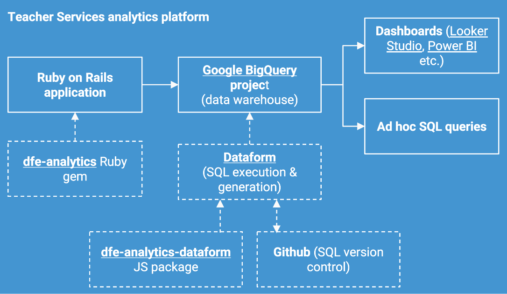

# Deciding what data to stream with ```dfe-analytics```
To ensure compliance with relevant legislation it is **imperative** that ```dfe-analytics``` users:
- Only stream personal data to BigQuery for which the Department has a legal basis for processing under GDPR
- Only retain this data for as long as this legal basis remains valid

It is also **recommended** that teams use 'hidden field' functionality to hide any more sensitive fields that are streamed, such as protected category data and human-readable Personally Identifiable Information (PII).

This guide sets out how teams should decide what data to stream with ```dfe-analytics``` and links to resources to explain how to do this.



```dfe-analytics``` is designed to be used alongside the [```dfe-analytics-dataform``` Dataform package](https://github.com/DFE-Digital/dfe-analytics-dataform/) to transform streamed data. The approach below relies on using both together. The diagram on the right shows how the two products are intended to work together. ```dfe-analytics``` is responsible for streaming events from the application into the ```events``` table in BigQuery. ```dfe-analytics-dataform``` is responsible for transforming these events into staging tables for analysis - for example, tables which are similar to tables in the application database, version history tables, funnel analysis tables, custom events tables etc. Most teams will also use Dataform to generate other tables to power dashboards and analysis which are bespoke to their needs.

## What is personal data?
Almost **all** data that is useful for data analysis in Teacher Services is personal data. Without being able to identify people it is not possible to count the things that are most important for analysis in Teacher Services, because these 'things' are people: teachers, teacher training candidates, trainee teachers, prospective teachers we are in contact with etc.

There are some common myths about what is and is not personal data. These are not true:
- "Only human readable personal data is personal data - email addresses, names etc." - in fact, anything that uniquely identifies an individual is personal data. Database identifiers, IP addresses etc. can all be personal data even if it is not possible for a human to identify who some data belongs to.
- "Replacing identifiers of individuals with other identifiers stops it being personal data" - this is a process known as pseudonymisation, defined under the GDPR as "…the processing of personal data in such a manner that the personal data can no longer be attributed to a specific data subject without the use of additional information". This process may improve data security in some situations, but does not stop data being personal data. For example, a database ID for a user is personal data. Passing this ID through a SHA256 one-way hash algorithm pseudonymises the personal data, but it does not stop being personal data as a result. See [ICO guidance](https://ico.org.uk/for-organisations/uk-gdpr-guidance-and-resources/personal-information-what-is-it/what-is-personal-data/what-is-personal-data/#pd4) for more information.
- "Removing personal identifiers from data stops it being personal data" - this myth can be true in some cases (for example, when data is 'anonymised' by aggregating together and only total figures are stored and processed); however it is not reliably true for data streamed by ```dfe-analytics```. This is because this streamed data includes every click on the service made by a user on the service, every database change made about that user's data, and in addition provides the capability to join this data together. This is potentially a significant volume of information about the user. Even with the identifiers removed it would still be possible in many cases to work out the user's identity. For example, a user's web traffic may tell us that they are an English teacher who was employed at a particular school in a particular year; cross referencing this information with publicly available teacher names on school websites would allow their identity to be deduced.

As a result it is recommended that teams consider **all** data streamed into BigQuery by ```dfe-analytics``` to be personal data unless proven otherwise.

## Who decides?
Under GDPR the **Department for Education** (DfE) should be the [Data Controller](https://ico.org.uk/for-organisations/uk-gdpr-guidance-and-resources/controllers-and-processors/controllers-and-processors/what-are-controllers-and-processors/) for all personal data streamed into BigQuery with ```dfe-analytics```. The Data Controller is "the natural or legal person, public authority, agency or other body which, alone or jointly with others, determines the purposes and means of the processing of personal data'.

For some teams some or all of the data they Process may have a different Data Controller; for example, if an external organisation is the Data Controller and shares this data with DfE. In this case obtaining advice from the Data Protection Office is advised and further assurance processes may be necessary.

Within DfE a specific person is the [Information Asset Owner](https://www.gov.uk/government/publications/information-asset-owner-role-guidance/guidance-on-the-information-asset-owner-role-html) (IAO) for all personal data.  It is ultimately the IAO's reponsibility to ensure that:
- they understand what information is held by their unit or directorate
- risks to their information are being addressed
- information is appropriately protected and marked
- information is used in compliance with all legal requirements, such as the Data Protection Act 2018, UK GDPR, Freedom of Information/Environmental Information Regulations, the Public Records Act and the Inquiries Act.

This includes ensuring that a Data Protection Impact Assessment has been carried out for their service, supported by the relevant departmental teams.

For data streamed into BigQuery with ```dfe-analytics```, this is usually the Deputy Service Owner of the digital service that is streaming the data. If unclear, consult with the Senior Responsible Officer (SRO) for the digital service. The Teacher Services Data & Insights team is **never** the IAO for personal data in BigQuery. The Deputy Director of Teacher Services is also **not** the IAO for any personal data in BigQuery. This means that each team should either ensure that the relevant IAO decides what information they stream into BigQuery, or that they have appropriate delegated authority to take these decisions and keeps the IAO informed of the decision(s) taken and the risks involved.

## What is the basis for processing personal data in BigQuery?
```dfe-analytics``` and ```dfe-analytics-dataform``` have been designed with the ['public task' GDPR basis for processing](https://ico.org.uk/for-organisations/uk-gdpr-guidance-and-resources/lawful-basis/a-guide-to-lawful-basis/public-task/) in mind. They are not suitable for use with data that is stored and processed on [another legal basis](https://ico.org.uk/for-organisations/uk-gdpr-guidance-and-resources/lawful-basis/a-guide-to-lawful-basis/), for example consent, contract or legitimate interest. If personal data has been collected by a digital service on another legal basis it should **not** be streamed with ```dfe-analytics``` without further assurance and engineering. This work would need to ensure that if consent is withdrawn or there is a request for deletion of a user's data, it is possible to delete the full change history of this user's records in the database in BigQuery, as well as all their web traffic data.

## How do we exclude data from streaming?
Data for which DfE has no basis to store or process **must not** be streamed into BigQuery by ```dfe-analytics```.

This data may take the form of individual fields within a table in an application's database, or entire tables.

To exclude these fields, remove them from ```config/analytics.yml``` and add them to ```config/analytics_blocklist.yml```.

For more information see [here](https://github.com/DFE-Digital/dfe-analytics/tree/SL-dev?tab=readme-ov-file#5-send-database-events).

## How long should we keep data for?
Data processed under the 'public task' basis for processing described in the previous section may continue to be stored and processed for as long as it is needed for any of the public task(s) that is stored for. It is the IAO's ultimate responsibility to sign off on this.

This means that once it is no longer useful for any such task it **must** be deleted. For example:
- Data to support analysis of teachers' progression throughout their careers so that the effectiveness of policy measures to retain teachers can be evaluated might need to be retained for 50 years
- Data that is only stored to support evaluation of the impact of policy changes on ITT recruitment might need to be stored for a number of years (say, 7) but not longer
- Data that is only stored to support evaluation of the immediate effects of a design or content change to a digital service might only need to be stored for around a year

IAOs and their teams should also consider public tasks which may need to be performed by other teams within DfE, both now and in the future, when evaluating how long data should be retained for.

Teams **must** consider [implementing a data retention schedule](https://github.com/DFE-Digital/dfe-analytics-dataform/?tab=readme-ov-file#data-retention-schedules) in ```dfe-analytics-dataform``` to ensure that data streamed by ```dfe-analytics``` is deleted automatically once it is no longer required.

## How do we hide more sensitive data when it is streamed?
Data that is more sensitive than most personal data **should** be marked as such when it is streamed into BigQuery by ```dfe-analytics``` - if it is streamed at all. This includes:
- Human-readable PII, such as names, email addresses, telephone numbers, home addresses, national insurance numbers, passport numbers and TRNs
- [Special category data](https://ico.org.uk/for-organisations/uk-gdpr-guidance-and-resources/lawful-basis/special-category-data/what-is-special-category-data/) under GDPR: personal data revealing racial or ethnic origin; personal data revealing political opinions; personal data revealing religious or philosophical beliefs; personal data revealing trade union membership; genetic data; biometric data (where used for identification purposes); data concerning health; data concerning a person’s sex life; and data concerning a person’s sexual orientation.
- Free text fields that may conceivably be used to store this information

This data should be both:
1. hidden when it is streamed using ```dfe-analytics``` [hidden field functionality](https://github.com/DFE-Digital/dfe-analytics/tree/SL-dev?tab=readme-ov-file#5-send-database-events)
2. hidden when it is transformed using ```dfe-analytics-dataform``` and Dataform as described [here](https://github.com/DFE-Digital/dfe-analytics-dataform/?tab=readme-ov-file#hidden-fields).

This will ensure that by default, BigQuery users only have access to a pseudonymised version of this data. Only users who have been explicitly granted permissions to do so will have access to this data in its raw form.

It is a common misunderstanding that this feature is designed to 'hide personal data'. This is incorrect as almost all data in BigQuery is personal data (see above), not just more sensitive data like this. Using this feature to hide this data enhances its security but does not mean that other data in BigQuery can be considered not to be personal data.

## Who do I contact for more information or advice?
Please reach out to a Teacher Services Information Security Officer (ISO), the Data & Insights team (#twd_data_insights) and/or the DfE Data Protection Office for further advice and information.
